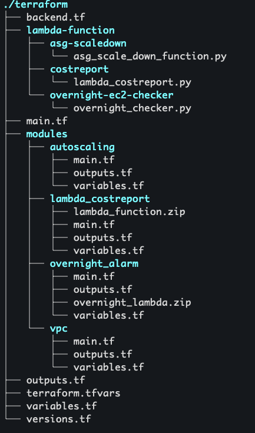

# NFI Cloud Assignment

This document outlines the assignment details for the NFI Cloud project.

Below is the screenshot of the project's terraform directory structure:



### Terraform Configuration Overview

- **Remote State Management:**  
  Uses an AWS S3 bucket for remote state storage, which keeps your state file secure (with encryption) and centralized. You can create this bucket manually or in a separate Terraform project to keep state management isolated and avoid circular dependencies.


### Terraform Environments

- **Workspaces:**  
  Use `terraform workspace` to create and switch between different environments (e.g., dev, staging, production). Each workspace maintains its own state, ensuring that resource changes in one environment don’t impact the others. For example, you can create a new workspace with:  
  ```
  terraform workspace new dev
  ```
  and switch between environments with:
  ```
  terraform workspace select dev
  ```

- **Environment-Specific Files:**  
  Alternatively, you can manage different environments by using separate variable files (such as `.tfvars` files) or environment variables to isolate configuration settings.


### Secure VPC Configuration

- **CIDR Block:**  
  Defines the overall IP address range for the VPC.

- **Subnets:**  
  - **Public Subnet:** Houses resources that require direct internet access via an Internet Gateway.  
  - **Private Subnet:** Isolates backend resources; these access the internet securely using a NAT Gateway.

- **Multi-AZ Deployment:**  
  Subnets are distributed across multiple Availability Zones to ensure high availability and resilience.

- **Gateways & Routing:**  
  - **Internet Gateway:** Provides direct external connectivity for the public subnet.  
  - **NAT Gateway:** Enables secure outbound internet access for resources in the private subnet.  
  - **Route Table:** Configures traffic flow between subnets and the respective gateways.

**VPC Diagram:**

Below is the screenshot of the VPC diagram:


### Auto Scaling Group Behavior

- **Morning Scaling (6:00 AM):**  
  At the beginning of the day, the auto scaling group launches at least two EC2 instances using the custom AMI created in step 2.

- **Evening Scaling (6:00 PM):**  
  At the end of the day, the auto scaling group terminates all running EC2 instances.


### Billing Report and Notification

- **Event Trigger:**  
  An EventBridge rule monitors EC2 instance terminations, which triggers a Lambda function.

- **Lambda Function:**  
  The EventBridge rule invokes a Lambda function that extracts the billing details for the terminated instance and prepares a report.

- **SNS Email Notification:**  
  The Lambda function publishes this billing report to an SNS topic, which then sends an email to a predefined list of subscribers.

> **Note:** AWS billing data is not available in real-time; there is typically a 24-hour delay. The billing report includes details from the last 2 days to accommodate this delay.


Below is the screenshot of a sample billing report email:


### Overnight EC2 Alarm

- **Scheduled Trigger:**  
  A scheduled EventBridge rule triggers a Lambda function at 6 AM daily.

- **Lambda Function:**  
  The function checks for any EC2 instances that have been running overnight.

- **SNS Notification:**  
  If an instance is found, the Lambda function sends an alert by publishing a notification to an SNS topic, which in turn emails a list of subscribers.

**Sample Alert Email Screenshot:**

Below is a screenshot of the alert email:
  

